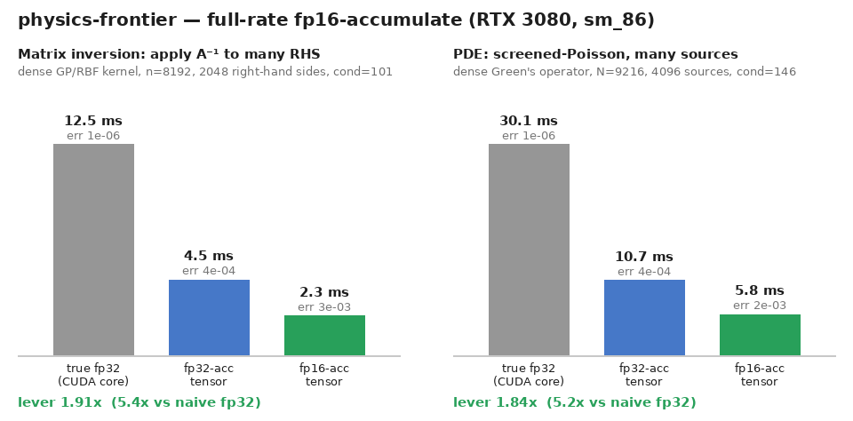

# physics-frontier — faster dense linear algebra for physics on a consumer GPU (RTX 3080, sm_86)

The dense GEMM is the hot loop of a large slice of computational physics — dense
linear solves, covariance / kernel methods, reduced-order models, and the many-source
apply of a PDE Green's function. This repo speeds that GEMM up on a consumer RTX 3080
with **one free lever** — the full-rate fp16-accumulate tensor path — and measures the
accuracy cost of it honestly.

## The lever: ~1.9× when ~1e-3 is acceptable

Consumer Ampere runs `mma` with an **fp16 accumulator at full rate and fp32 at half
rate**; cuBLAS defaults to fp32 for safety, leaving ~1.8× on the table. Where the
numerics tolerate ~1e-3, flipping the accumulator
(`torch.backends.cuda.matmul.allow_fp16_accumulation = True`) is nearly-free
throughput. Same lever as [nerf-frontier](https://github.com/Unified-Sciences/nerf-frontier)
and [search-frontier](https://github.com/Unified-Sciences/search-frontier); here,
applied to dense physics solves.

| workload | shape | lever (fp32acc→fp16acc) | vs naïve fp32 | fp16-acc rel-err |
|---|---|---|---|---|
| **Matrix inversion** → apply A⁻¹ to many RHS (`bench_solve.py`) | n=8192, 2048 RHS | **1.91×** | 5.3× | 3.4e-3 |
| **PDE** → screened-Poisson, many sources (`bench_pde.py`) | N=9216, 4096 src | **1.84×** | 5.2× | 2.3e-3 |



Both workloads are GEMM-bound in the same way: once you have a factorization or an
explicit operator, the recurring cost is applying it to a **block of many right-hand
sides** — 2048 RHS for the inverse apply, 4096 point-sources for the screened-Poisson
Green's function. That block apply is a large dense matmul, so it sits squarely on the
accumulator lever. The `vs naïve fp32` column is the speedup over the true-fp32 CUDA-core
path; the lever column is fp32-accumulate → fp16-accumulate on the tensor path at ~1e-3
relative error.

### Honest negatives (kept because they were hard-won)

- **Newton–Schulz inversion fails in fp16** — its slow initial phase increments below
  fp16 resolution, so the iteration stalls. Use it only in fp32 (or as an fp16-warm-start
  refined in fp32).
- **fp16 time-stepping of a PDE drifts** — the smoothest mode barely damps per step, so
  rounding error accumulates over a long trajectory. The lever is for **solves**, not fp16
  time-marching.
- **Iterative refinement can't rescue a *dense* explicit inverse** — fp16 storage of A⁻¹
  floors the accuracy at ~1e-3, and each refinement step is itself a full GEMM, so there is
  no cheap correction. If you need better than ~1e-3, stay on the fp32 path.

## Run

```bash
# torch 2.12 + CUDA 13 venv with an RTX 3080 (or any sm_86 GeForce). Pure torch, no build.
python bench_solve.py     # matrix inversion -> many-RHS apply (the 1.91× lever)
python bench_pde.py       # screened-Poisson many-source solve (the 1.84× lever)
python make_figure.py     # -> assets/physics_lever.png from the JSON
```

Each script writes a `results_*.json` (committed as the evidence). Output paths default to
the repo directory; override with `--out`.

## Dependencies

PyTorch ≥ 2.7 (for `allow_fp16_accumulation`) and an sm_86 GeForce. The accumulator lever
needs **no custom CUDA** — it is a one-line cuBLAS toggle. Tested on torch 2.12 + CUDA 13,
RTX 3080 10 GB.
